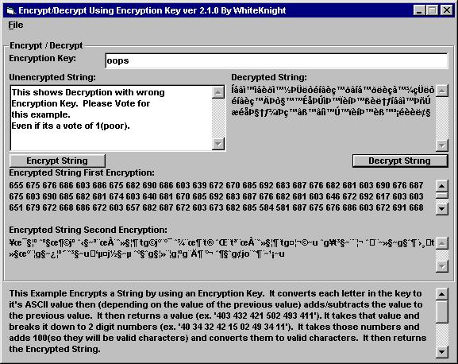



## Encryption/Decryption with an Encryption Key Ver 2\.1

### Description

(Update 7/31/00) Now Scrambles string before it encrypts its. Example shows each Encryption/Descryption Step to help you better understand how it does it. It Scrambles the string the same way each time. It takes all the 'even' characters and puts them first, then puts all the 'odd' characters after them. 

----

BUG FIXED

----

This Is an example of how to use a key string to encrypt a string. If a third party gets the encrypted message but doesn't know the Key (even if off by one letter) they cannot decrypt the message. (Updated on 6-3-00) This encrypts the string to numbers then converts the number to characters. comments were added to better explain how this encrypts. Any comments or sugestion on how to make this work better please e-mail them to me at witenite87@excite.com
 
### More Info
 

             |
---                |---
**Submitted On**   |2000-07-27 12:46:50
**By**             |[whiteknight](https://github.com/Planet-Source-Code/PSCIndex/blob/master/ByAuthor/whiteknight.md)
**Level**          |Intermediate
**User Rating**    |4.8 (86 globes from 18 users)
**Compatibility**  |VB 5\.0, VB 6\.0
**Category**       |[Encryption](https://github.com/Planet-Source-Code/PSCIndex/blob/master/ByCategory/encryption__1-48.md)
**World**          |[Visual Basic](https://github.com/Planet-Source-Code/PSCIndex/blob/master/ByWorld/visual-basic.md)
**Archive File**   |[CODE\_UPLOAD84317312000\.zip](https://github.com/Planet-Source-Code/whiteknight-encryption-decryption-with-an-encryption-key-ver-2-1__1-8539/archive/master.zip)

